# Flag from Temu

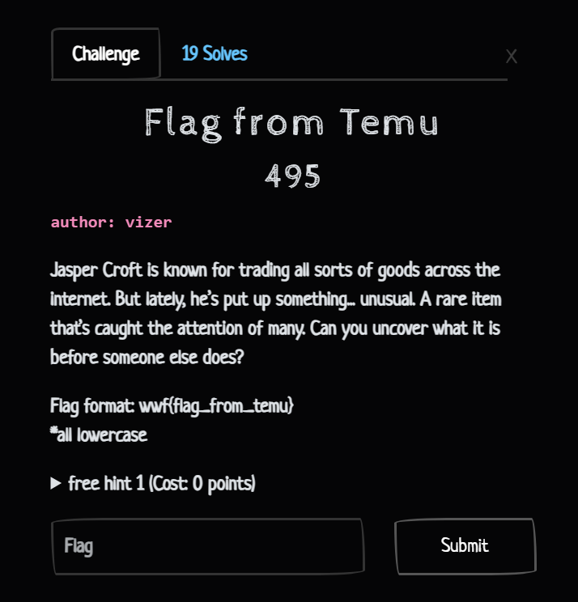

## Solution

Now that you’ve got a name, start digging — you’ll track him down on Facebook in no time:
<https://www.facebook.com/jaspercroft111>
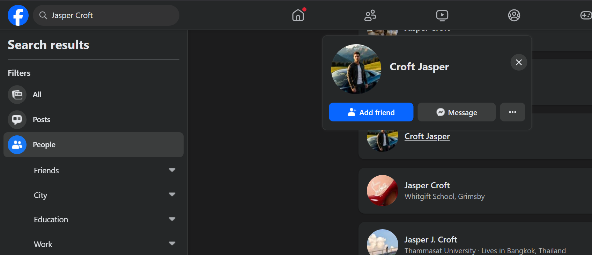
When you visit this Facebook account, you’ll see a few posts about the products he’s selling, but there’s no sign of any flag `(°ー°〃)`

But actually, Facebook has a dedicated section for buying and selling.
 It’s called ``Facebook Marketplace``
 Reference article: <https://www.forensicosint.com/facebook-marketplace-osint-research-goldmine>
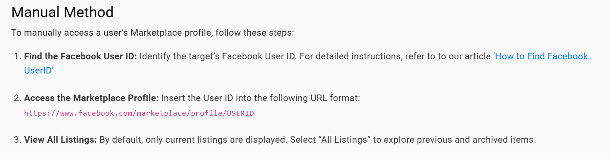
And just like that, we’ve struck gold: <https://www.facebook.com/marketplace/profile/100055248164491>

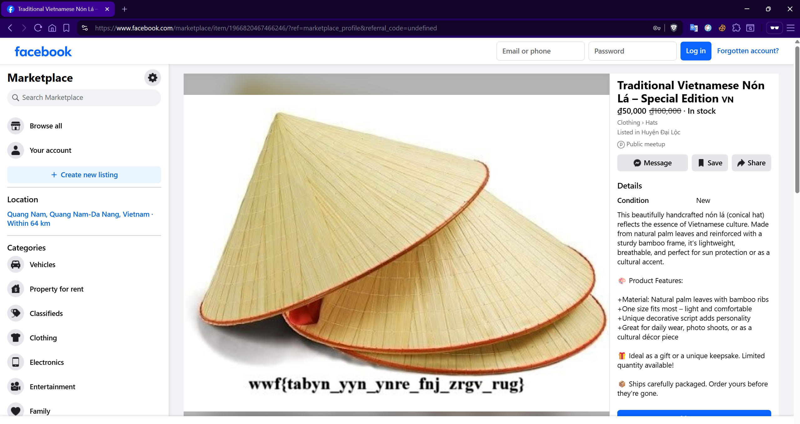
While creating the challenge, I thought it might be a bit too easy for everyone — so I decided to add a little encryption to the flag LOL

Btw, here’s the flag:
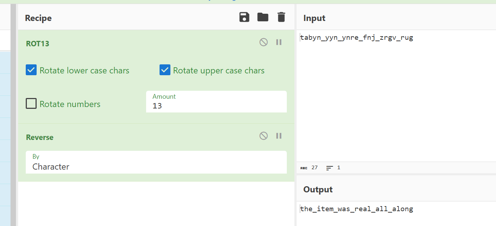

### FLAG: ``wwf{the_item_was_real_all_along}``

 

# Memories Linger On

## Solution

From Facebook, you can find a post where Jasper Croft opens up about his feelings, saying:

> ``"I just want a space where I can speak the truth, without judgment, without masks."``

I knew you’d try using some tools to find the username, so I picked a newer platform that hasn’t been added to those tools yet.
By the way, here’s the platform I’m talking about: <https://truthsocial.com/@jaspercroft11>

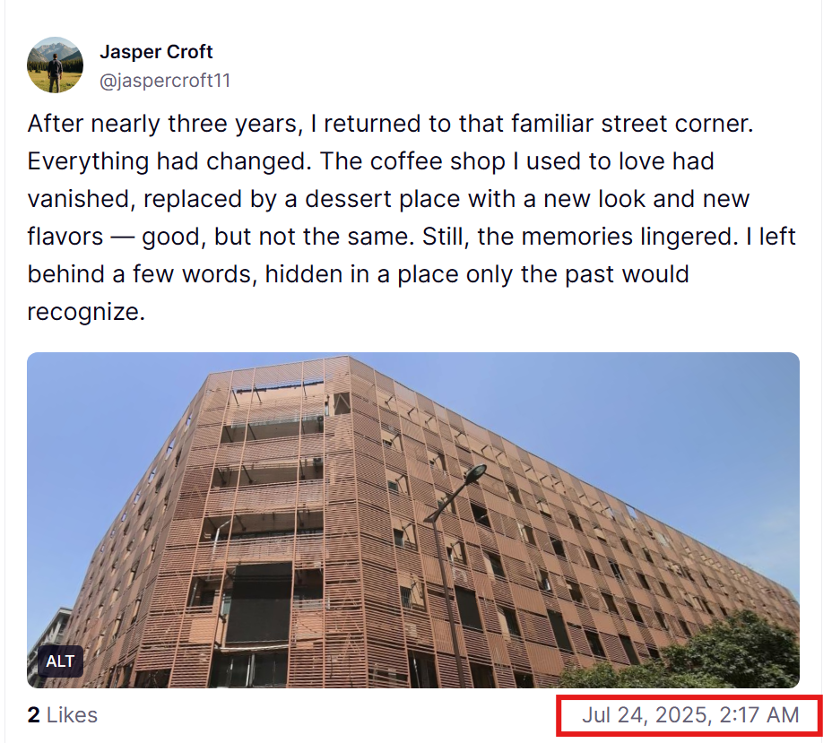
Alright, there’s an image — this is definitely a GEOINT challenge.
 If you’re familiar with OSINT challenges, you’ll know some common reverse image search tools like Google Lens, Yandex, Baidu, Bing, etc.
In this case, only Baidu will give you results(since the image is from China)

But if that’s still not enough to convince you — if you still think this is just a “guessy” challenge — then it’s time to take a closer look at the timeline:

It seems like he spent some time living in Da Nang, Vietnam — that would explain the post.
>
> - ``Facebook post date: July 26, 2025``
> - ``TruthSocial post date: July 24, 2025``

That means he didn’t spend much time traveling — so a simple thinking would be that he came from a nearby country.
 And yeah, we’ve got Baidu as our search tool:
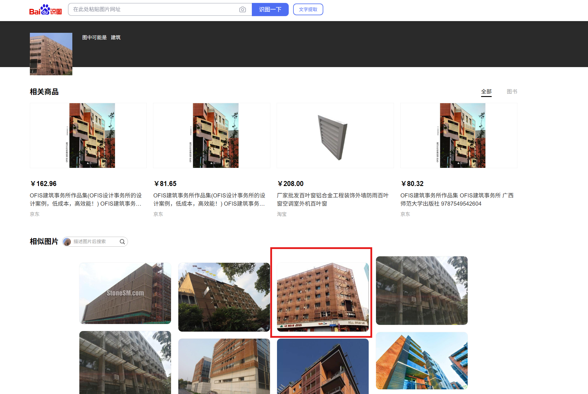
Just upload the image — it’s super easy to get results.
Click on it, and you’ll see more detailed matches.
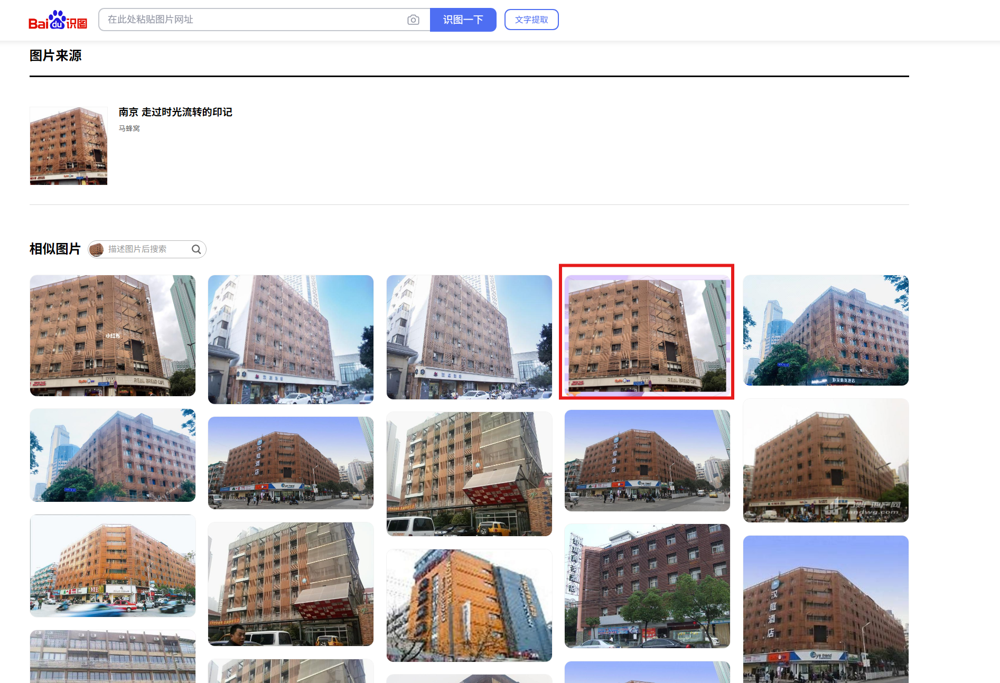
We’ll end up with a [detailed article](https://mbd.baidu.com/newspage/data/dtlandingsuper?nid=dt_4180157765767122642) showing the exact address of this café.
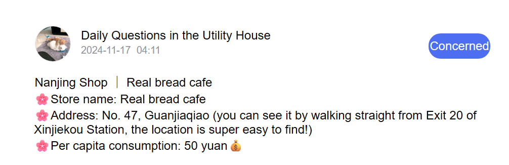
Using the provided address with [Baidu Maps](https://map.baidu.com/search/the%20flour%20house%C2%B7bakery%26cafe(%E7%AE%A1%E5%AE%B6%E6%A1%A5%E5%BA%97)/@13223615.51,3746926.37,19z#panoid=0900250012221009104757332AD&panotype=street&heading=205.13&pitch=0&l=19&tn=B_NORMAL_MAP&sc=0&newmap=1&shareurl=1&pid=0900250012221009104757332AD) and switching to street view, you’ll see that the place is now a bakery — but it used to be a café.

Search the café name on Google, you’ll find location tag on Instagram:
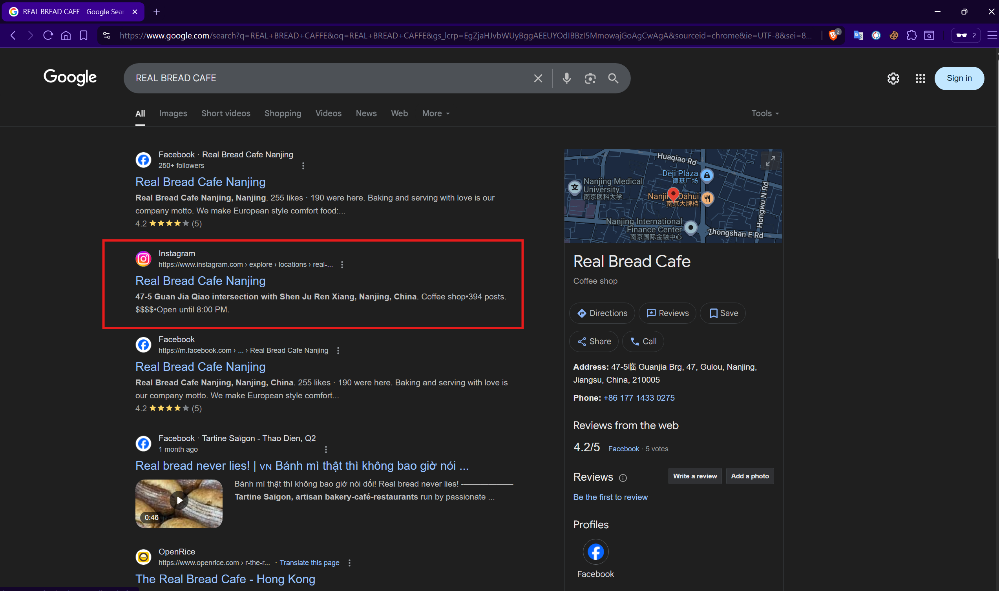
Click on it and select the “Recent” section — you’ll find Jasper’s post there.
<https://www.instagram.com/p/DMipDAQTBOz/>
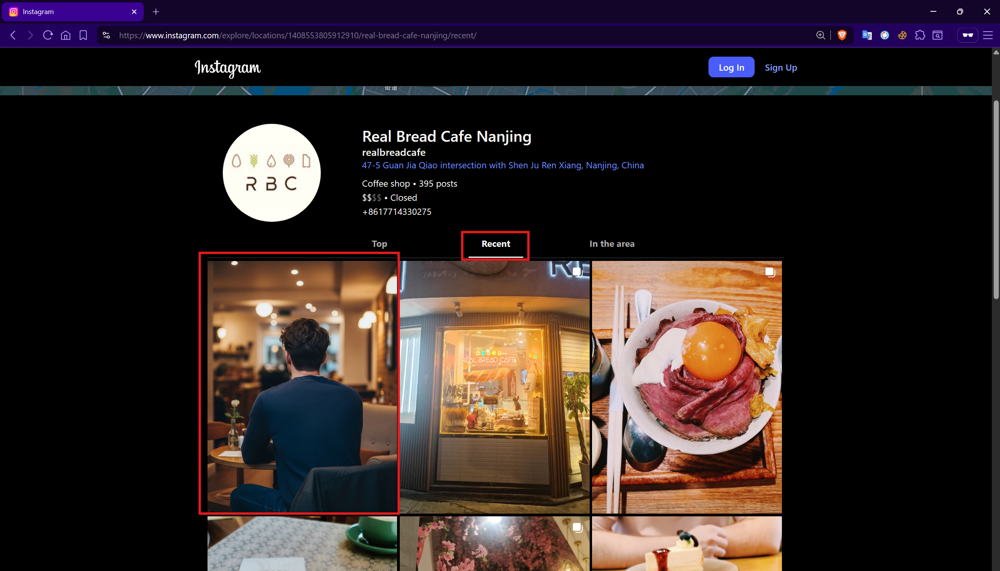

### FLAG: ``wwf{some_memories_never_fade}``

# Location Unknown ◐

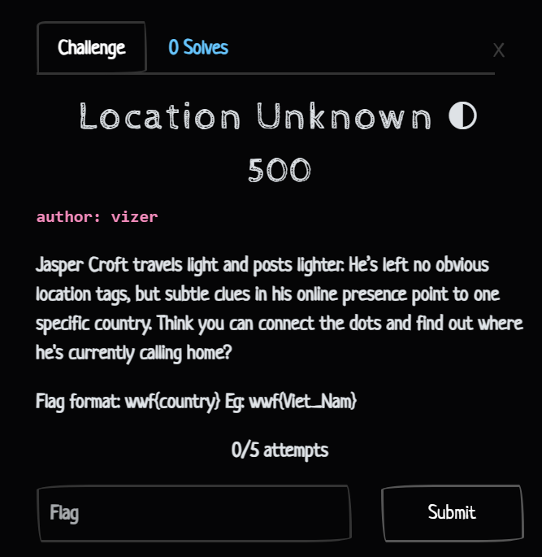

## Solution

I intentionally set this challenge to only open once you solved the ``Flag from Temu`` challenge — it’s all part of the flow.

Go back to the Marketplace post — you’ll see all the payment methods mentioned there (the email used for PayPal seems to have been locked by Meta or something, I’m not really sure LOL).

>
>- <https://cash.app/$jaspercr11>
>- <https://venmo.com/jaspercr>
>- <https://buymeacoffee.com/jaspercr>

You can try checking each one — none of them actually exist, including the email address <jaspercr11@gmail.com>.
 The only one you can use is Revolut: <https://www.revolut.me/jaspercr>
If you’re someone who keeps up with cybersecurity news on social media, then you’ll probably recognize this:
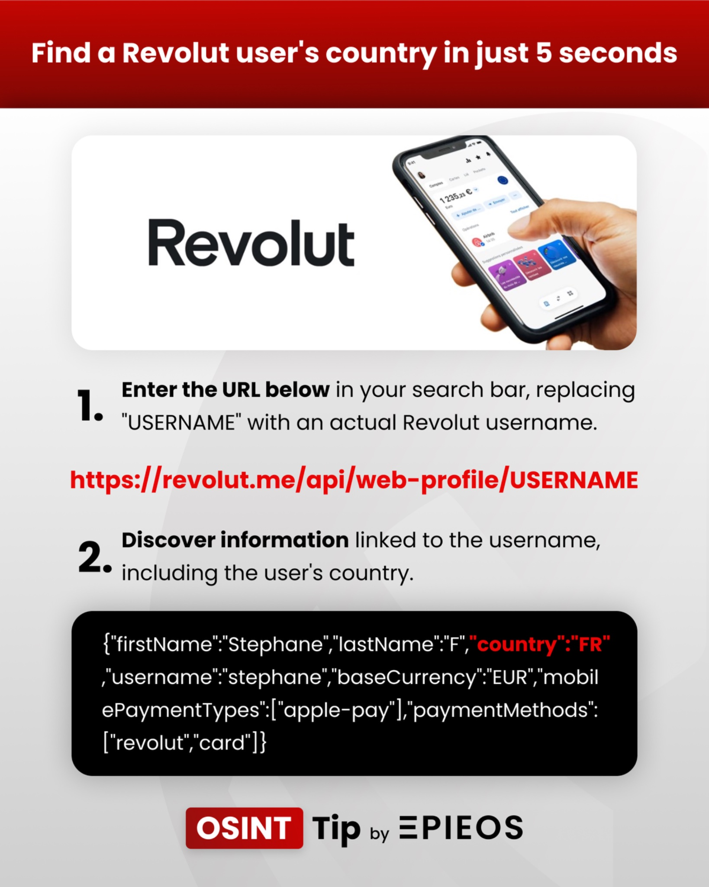
Or if you don’t know it — just Google it lol.
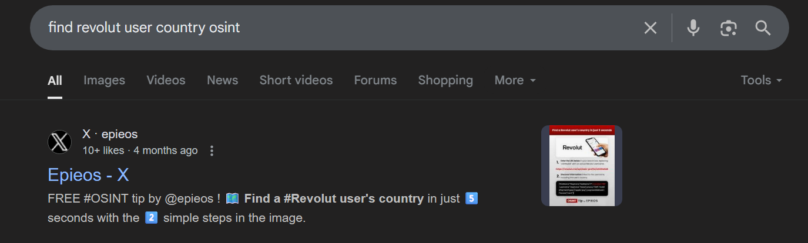
Visit the link and you’ll get the answer: <https://www.revolut.me/api/web-profile/jaspercr>
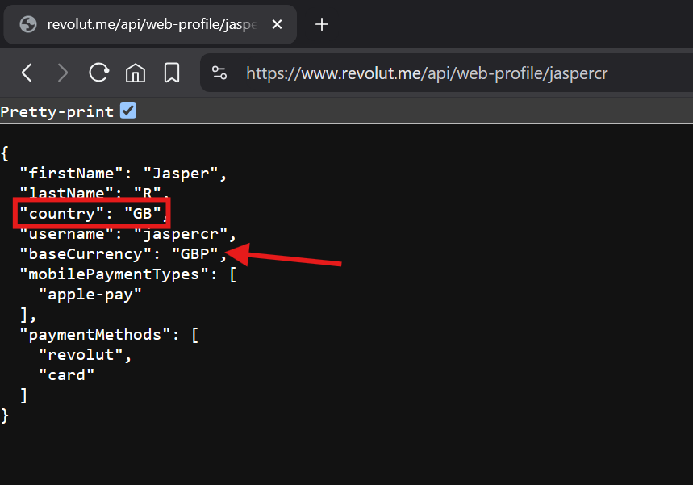

### FLAG: ``wwf{Great_Britain}``

# Postscript

Thanks for diving into my OSINT challenges!
I hope this writeup inspires some fresh ideas and helps sharpen your investigative instincts for future CTFs.
 See you in the next one — same time, sharper minds! 

:::IMPORTANT
Happy hunting! 🔍
:::
