# Bulletproof

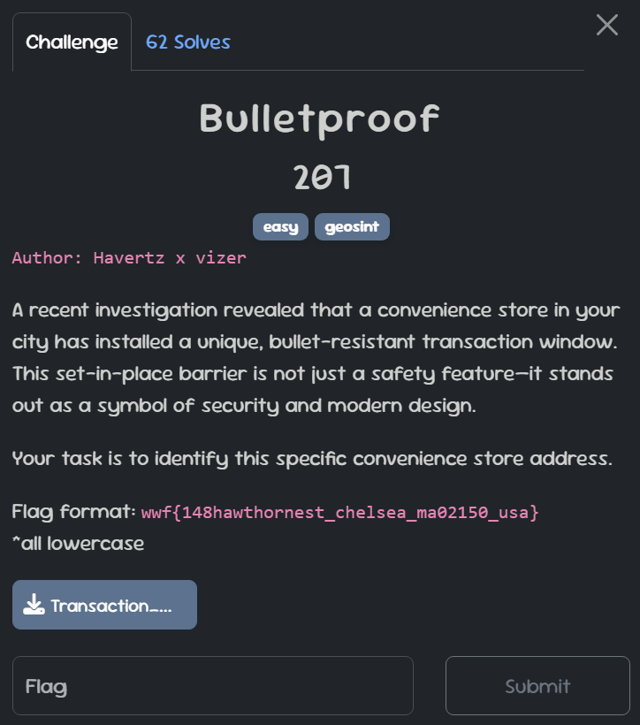
[`⬇️Transaction_Window_Line_System.jpg`](./img/Transaction_Window_Line_System.jpg)

## Solution

Looking at the corner of the image, we can see some details that are "a bit blurry," but clear enough to read:

After that, search on Google, and with a bit of effort, we’ll get the result:
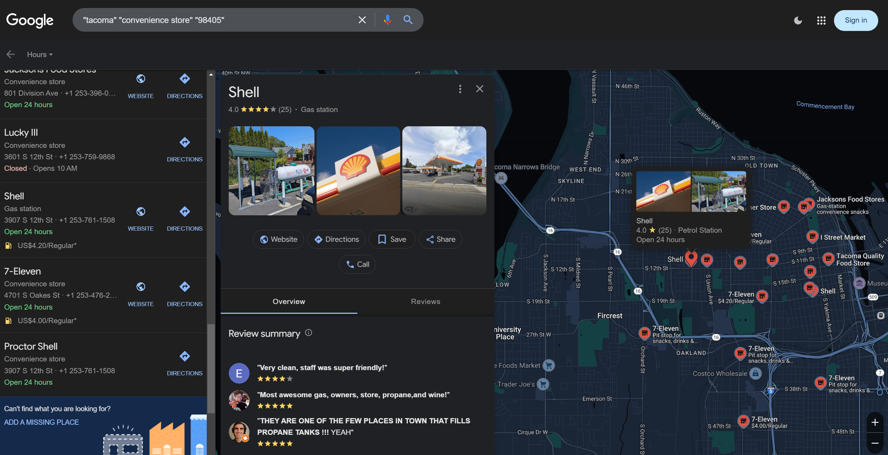
Go to Google Maps and just copy the address; you'll get the flag:
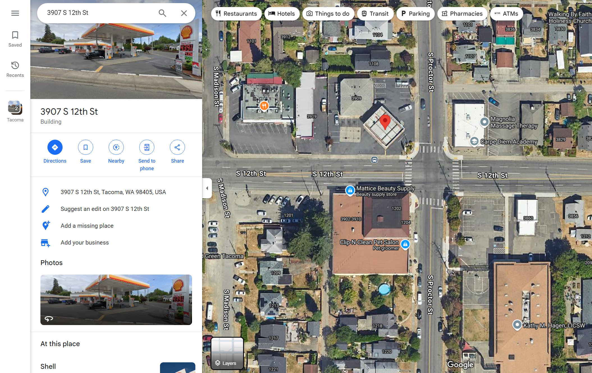

### FLAG: ``wwf{3907s12thst_tacoma_wa98405_usa}``

 

# To the sky

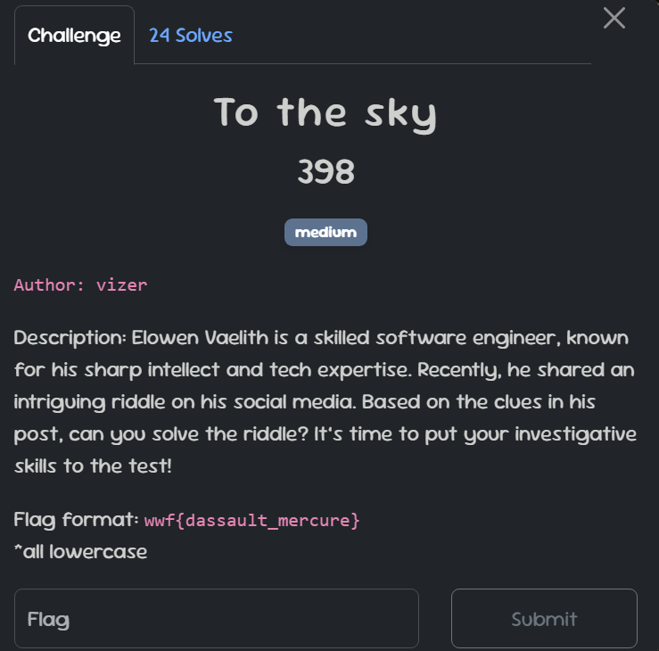

## Solution

The person we need to look for is named "Elowen Vaelith." You'll easily find him on familiar platforms like:
>
> - [X(Twitter)](https://x.com/elowenvaelith)
> - [Instagram](https://www.instagram.com/elowenvaelith)
> - [Github](https://github.com/elowenvaelith)

But I anticipated that, so I intentionally created an account on [``Tumblr``](https://www.tumblr.com/elowenvaelith). This platform is very well-known, but it might not be as popular among users like us (‾◡◝)

Visit his profile, and you'll immediately see a post with a riddle about airplanes:
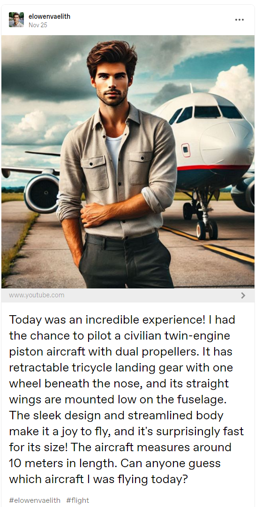
During the CTF, some people used AI chatbots to solve the riddle. I tried it before too, but it didn’t give the correct answer (maybe my chatbot was acting dumb )

The intended solution for this challenge is to use this website:
<https://www.aircraftrecognitionguide.com/identify-aircraft/identify-by-airplane-characteristics>

From the details in the post, use the filter to narrow it down to two civilian-use airplanes (click [**``HERE``**](./img/aircraftrecognitionguide-identify-aircraft-identify-by-airplane-characteristics.png) to see the full filter)

So how do we figure out which one is correct? He mentioned that the plane he piloted is about 10 meters long. Try looking up the lengths of these two planes:
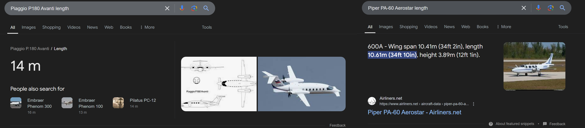

### FLAG: ``wwf{piper_aerostar}``

 

# Identity

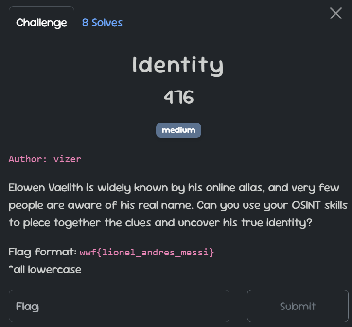

## Solution

Digging deeper into the accounts we've found, we'll discover an email address from his GitHub profile by adding `.patch` to the end of the commit URL.
 For example: <https://github.com/elowenvaelith/fuzzy-octo-garbanzo/commit/469247573c730141ec1848fa1d074c97b34c29eb.patch>

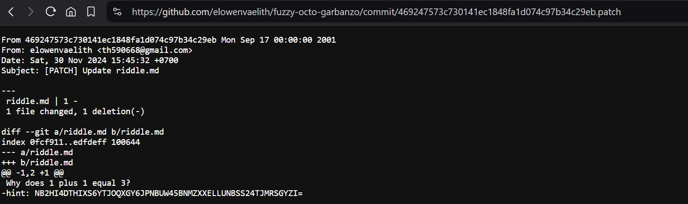
So his email is: `th590668@gmail.com`  
Try sending him an email, and you’ll receive an automatic reply email:
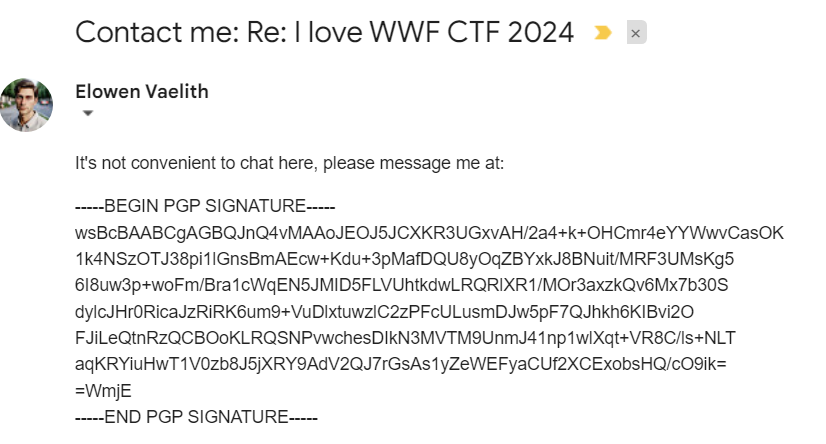
There are plenty of resources analyzing PGP signatures; here’s one of them: <https://gaevoy.com/2019/05/10/pgp-signature.html> 

Use this tool to decode the PGP: <https://cirw.in/gpg-decoder> 
The [article](https://gaevoy.com/2019/05/10/pgp-signature.html) above provides a full analysis of the components in a PGP signature after decoding, but here, we only need to focus on the `KeyId`.
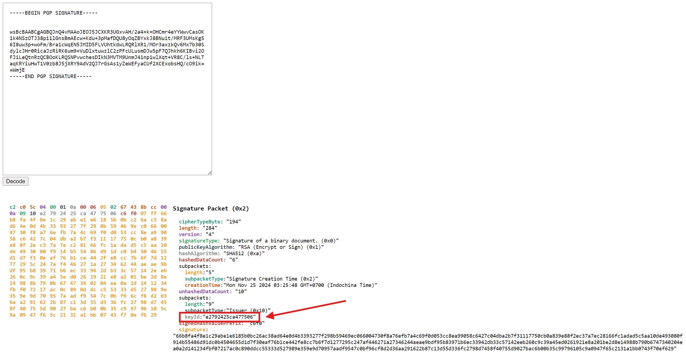
A quick explanation about KeyId: (from the [article](https://gaevoy.com/2019/05/10/pgp-signature.html))
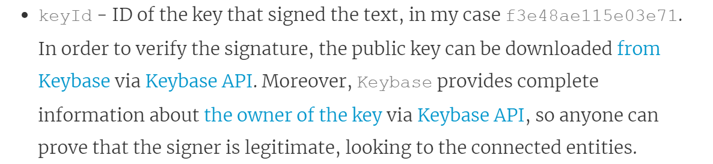
In our case, the **KeyId** is `e2792425ca477506`. By combining it with Keybase's API link, we get the complete URL:  
<https://keybase.io/_/api/1.0/key/fetch.json?ops=4&pgp_key_ids=e2792425ca477506> 

Access the link, and you’ll get his Keybase username: `orionjules`
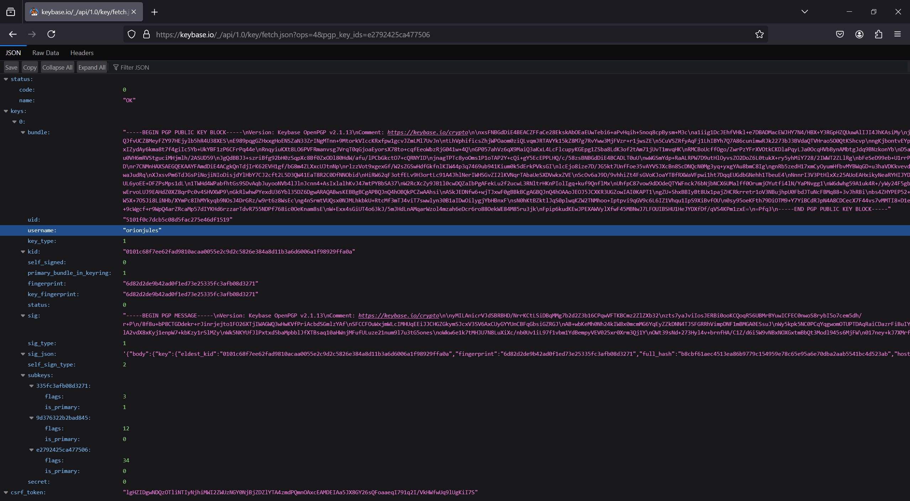
By accessing Keybase, we can get his real name:
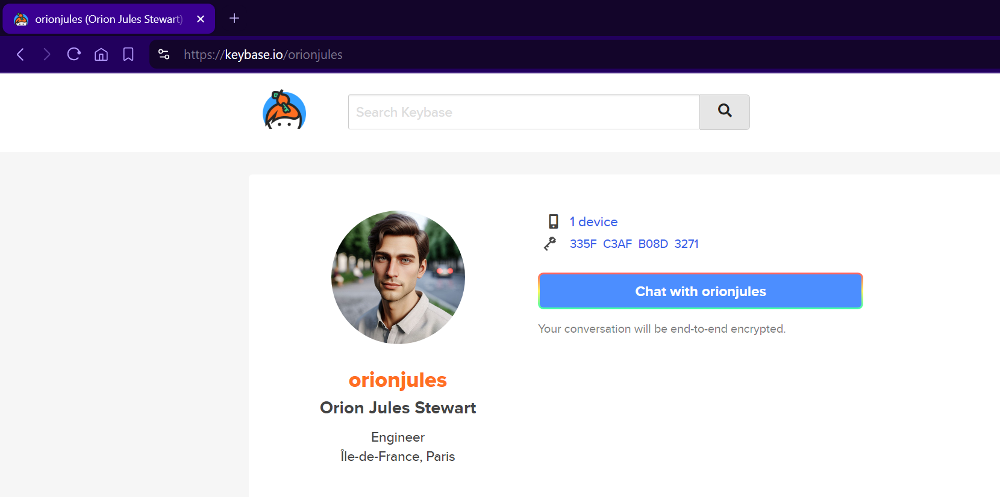

### FLAG: ``wwf{orion_jules_stewart}``

 

# Memorial

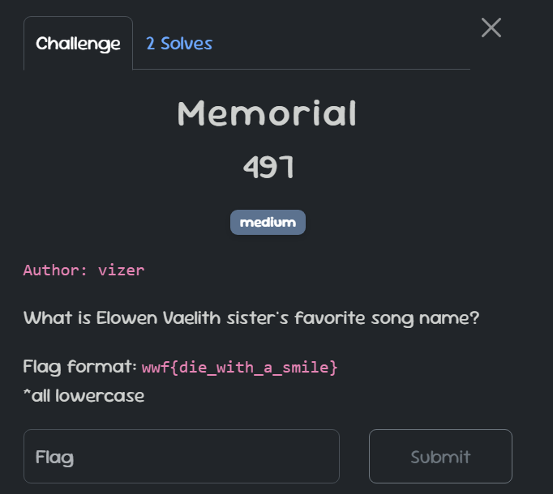

## Solution

Going back to Tumblr, we will see this post:
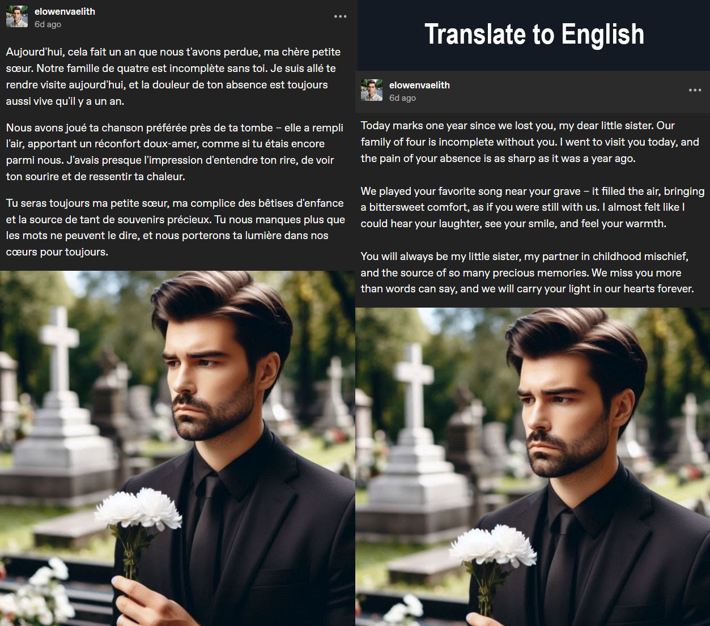
He mentioned his family, and with a bit of reasoning we can follow the clues to uncover the family tree.
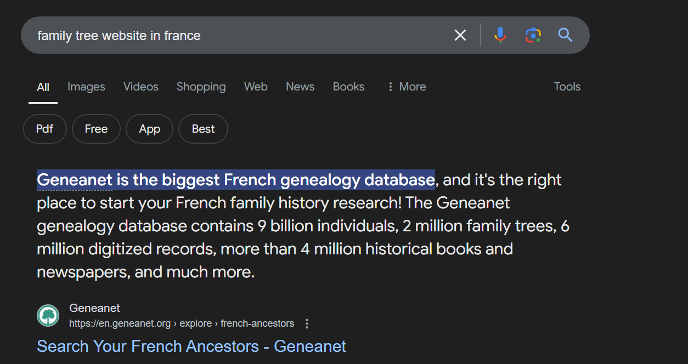
Access the website and using the name we found in the previous challenge, we can find his family tree:
<https://gw.geneanet.org/th590668?n=stewart&p=orion+jules&type=tree>
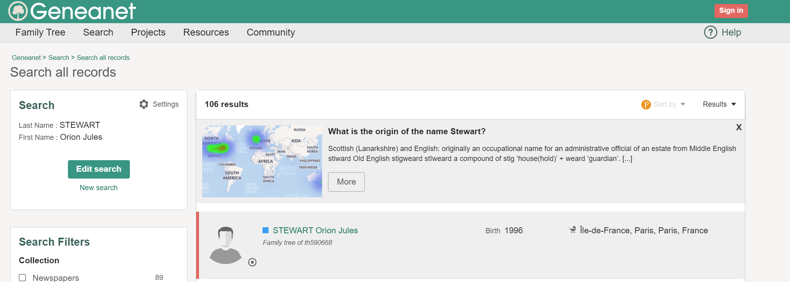
And here, we will also find out the favorite song of his sister: <https://www.youtube.com/watch?v=-uFQzcY7YHc>
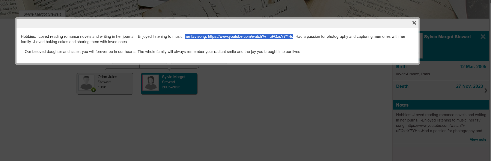
<iframe width="100%" height="468" src="https://www.youtube.com/embed/-uFQzcY7YHc?si=MosgkVWNhQpco9xI" title="YouTube video player" frameborder="0" allow="accelerometer; autoplay; clipboard-write; encrypted-media; gyroscope; picture-in-picture; web-share" referrerpolicy="strict-origin-when-cross-origin" allowfullscreen></iframe>

### FLAG: ``wwf{head_in_the_clouds}``

# Postscript

Thank you for diving into my OSINT challenges! I hope this writeup sparks creativity and sharpens your investigative skills for future CTFs.
 See you in our CTF next year!  

:::IMPORTANT
Happy hunting! 🔍
:::
