# Challenge Description

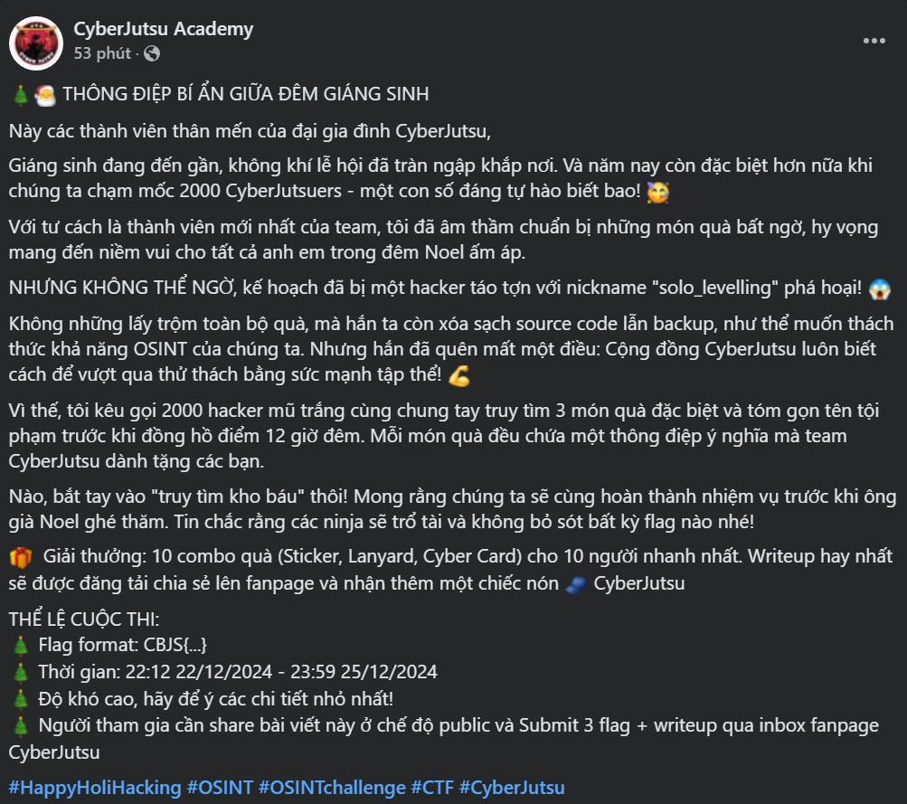

## Solution

Với username ``solo_levelling`` mình đã dùng tool để tìm kiếm xem nó được sử dụng ở những trang web nào:
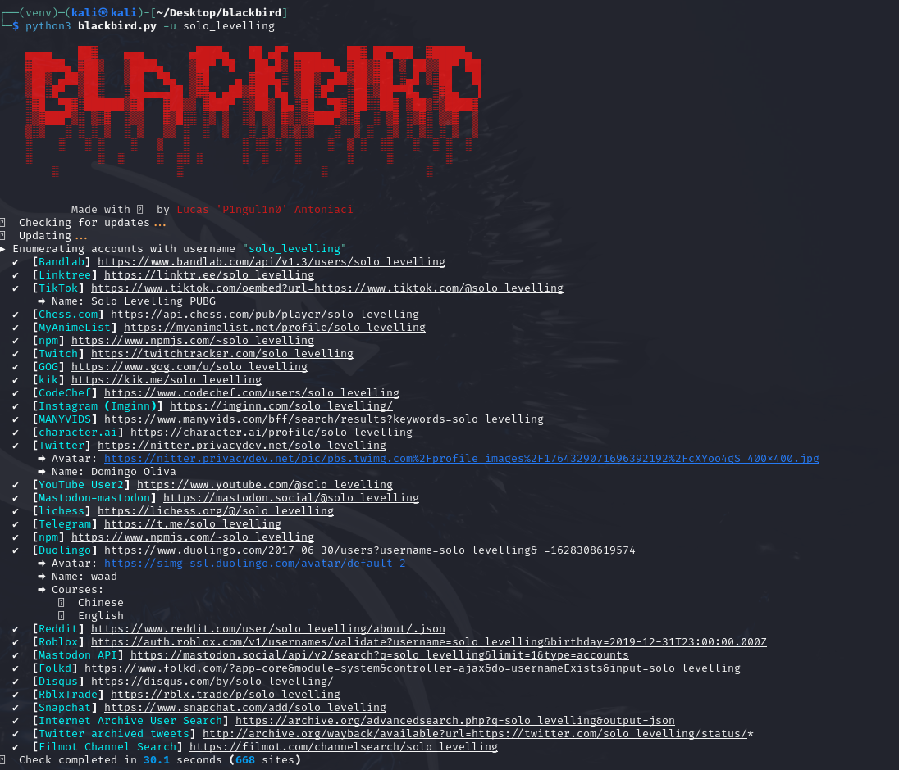
Sau khi tool trả kết quả thì mình kiểm tra thấy có 2 nơi có vẻ là hợp lệ là [Mastodon](https://mastodon.social/@solo_levelling) và [Linktree](https://linktr.ee/solo_levelling) Truy cập vào Linktree thì mình có được thêm 1 tài khoản [Linkedin](https://www.linkedin.com/in/uchiha-madara-45a51933b):
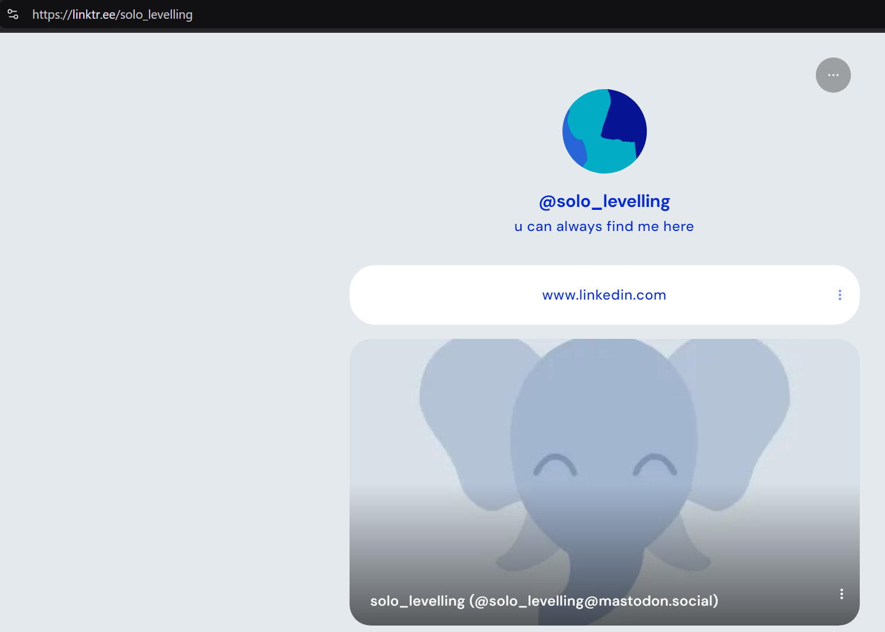
Trong Linkedin chỉ có 1 bài viết share repo github của người này --> Có thêm 1 tài khoản là [Github](https://github.com/solo-levelling21)
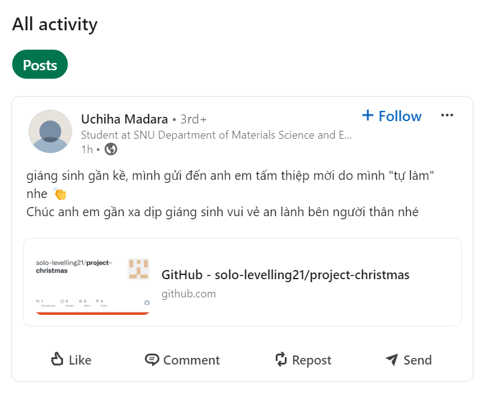
Trong Github, truy cập vào phần commit của repo [project-christmas](https://github.com/solo-levelling21/project-christmas/commits/main/) thì ta thấy rất nhiều lần chỉnh sửa. Trong đó có 1 cái được đặt tên là: [``people gonna love this``](https://github.com/solo-levelling21/project-christmas/commit/8c48d7850f7520e4dc84f3bbbfbc296a0d7d1f71). Truy cập vào thì sẽ có được flag ở phần Comments:

### Flag: ``CBJS{hehehee_ban_co_de_lai_gi_trong_github_commit_hong???!}``

Có tổng cộng là 3 Flag nên chúng ta sẽ tiếp tục tìm kiếm 2 cái còn lại （￣︶￣）↗

Bên trong repo Github sẽ có thêm 1 email: ``minhbeopro123456@gmail.com``, nhưng nó không có tác dụng gì cả :<  (Nếu ai thắc mắc cách có được email này thì hãy đọc bài viết này của mình: [Cách lấy email từ Github](https://vjz3r.github.io/posts/world_wide_ctf_2024/worldwidectf/#solution-2))

Đã đến lúc sử dụng tài khoản Mastodon tìm được lúc đầu. Truy cập vào thì mình thấy có 3 bài viết, có 1 bài có đường dẫn Google Drive tới 1 file tên là: [xmas.MOV](https://drive.google.com/file/d/1TtV_IWN_b-3jTB4RY8unQ2RMDy6TmttM/view)
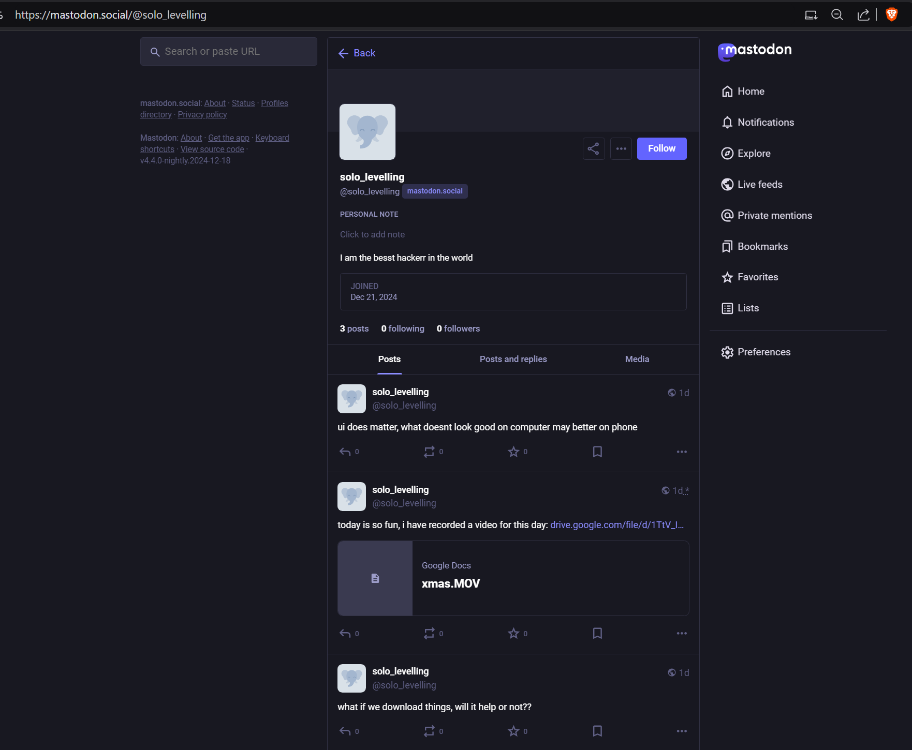
Truy cập vào để xem đoạn video ngắn, ở giây số 5 đã tiết lộ ra 1 thông tin quan trọng:
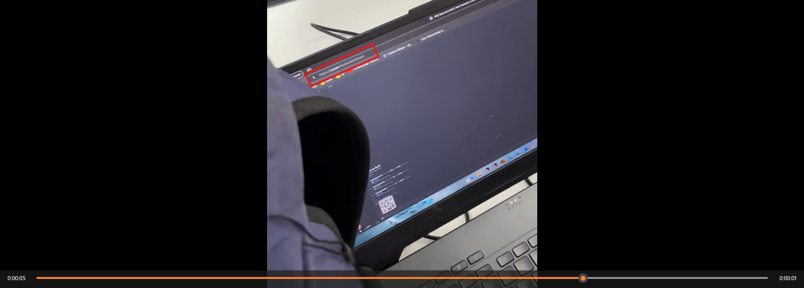
Có thể thấy rõ ràng 1 đường link là: <https://x.com/hackerbinhthanh>. Vậy đây lại là 1 tài khoản khác của người này
Truy cập vào trang cá nhân thì sẽ thấy có 1 ảnh QRCODE đập vào mắt :]]] và khi scan nó thì sẽ có thêm 1 flag nữa ＼（〇_ｏ）／
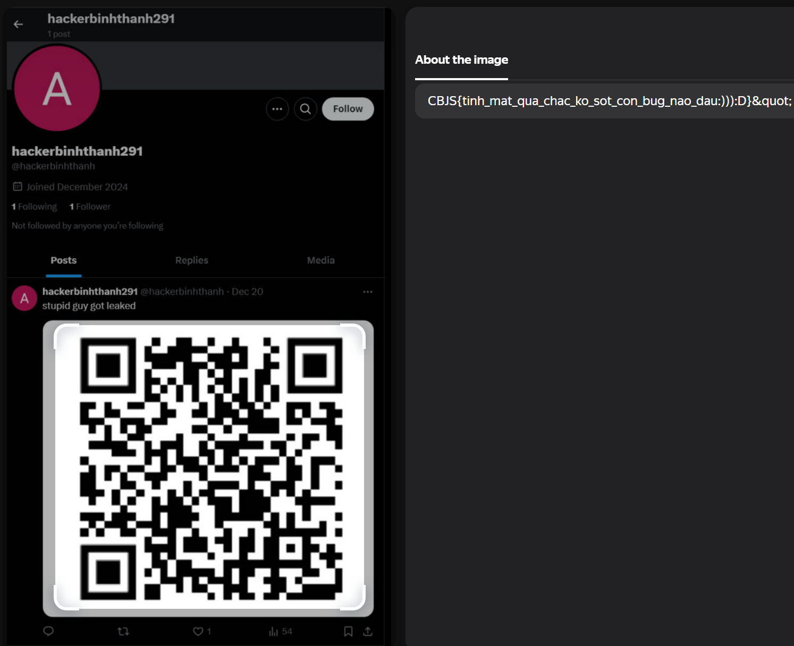

### Flag: ``CBJS{tinh_mat_qua_chac_ko_sot_con_bug_nao_dau:))):D}``

Flag cuối cùng này mình cũng không ngờ tới ;-; Nhưng với sự giúp đỡ của 1 người bạn thì mình đã tìm thấy hehe

Mình chỉ tập trung vào cái username của hacker nhưng lại bỏ qua 1 chi tiết `thành viên mới nhất của team`, trong phần comment của bài viết thì người này đã viết bình luận nhờ giúp đỡ:
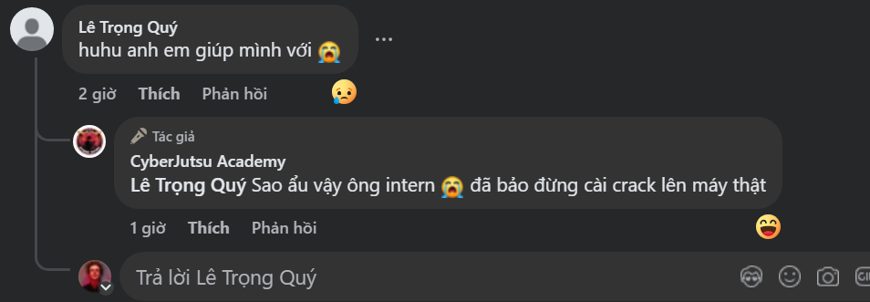

Bấm vào xem trang cá nhân của anh ta thì mình đã phát hiện có 1 bài viết đã được chỉnh sửa:
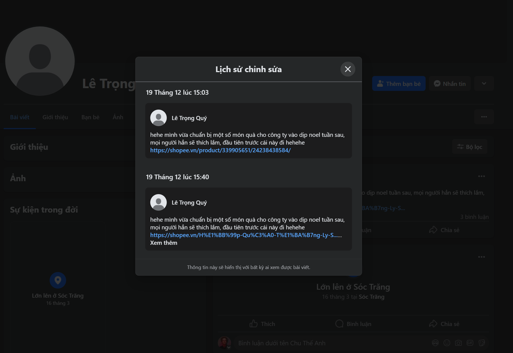
Đây là đường link trước khi bài viết được chỉnh sửa: <https://shopee.vn/product/339905651/24238438584/>
 Sau khi truy cập vào đường link, ở dưới phần "Mô tả sản phẩm" mình thấy có 1 khoảng trắng rất lớn nên kiểm tra thử thì đã phát hiện ra bí mật được ẩn giấu:
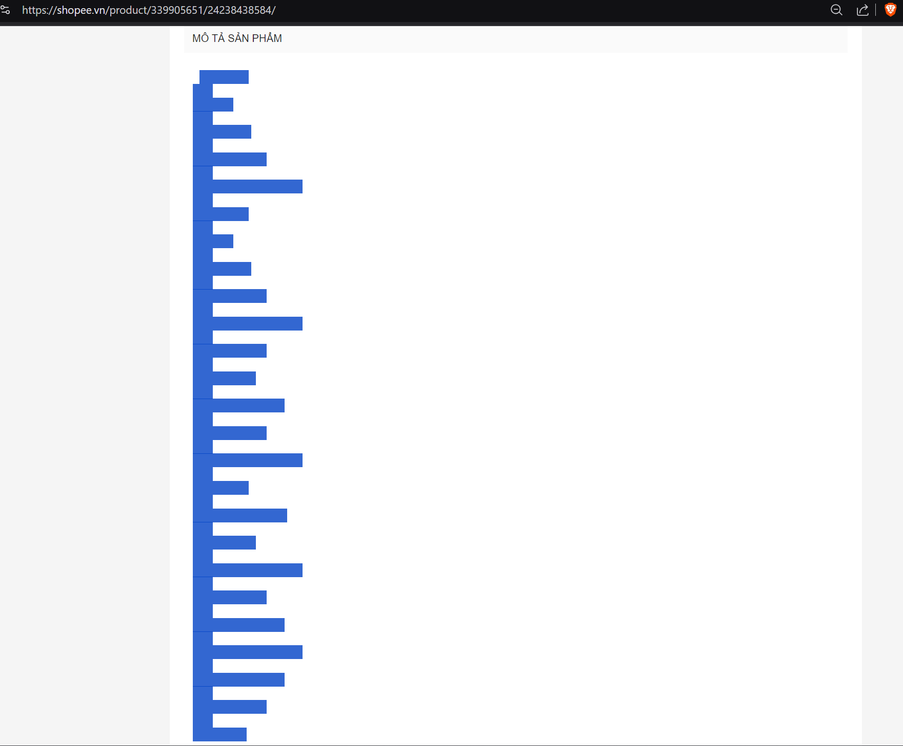
Đây chính là Whitespace Language, dùng công cụ này <https://dcode.fr/whitespace-language> để giải mã thì mình đã có được Flag cuối cùng:

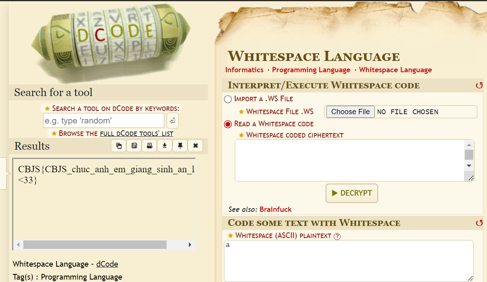

### Flag: ``CBJS{CBJS_chuc_anh_em_giang_sinh_an_lanh!!!<33}``

# Postscript

Trước hết em xin cảm ơn Team CyberJutsu đã tạo ra sân chơi để mọi người cùng nhau tham gia :>
 Đây là 1 thử thách cũng tương đối dễ, mọi thứ đều được liên kết với nhau liền mạch và không có Rickroll 🤡
 Bài viết của mình đến đây là kết thúc, cảm ơn mọi người đã đọc tới đây. Hy vọng mọi người sẽ học được thêm gì đó từ bài viết này.
:::important
Merry Christmas and Happy New Year!!!
:::
<iframe width="600" height="315" src="https://www.youtube.com/embed/aAkMkVFwAoo?si=_KCq4Du5u91G-SqD" title="YouTube video player" frameborder="0" allow="accelerometer; autoplay; clipboard-write; encrypted-media; gyroscope; picture-in-picture; web-share" referrerpolicy="strict-origin-when-cross-origin" allowfullscreen></iframe>
